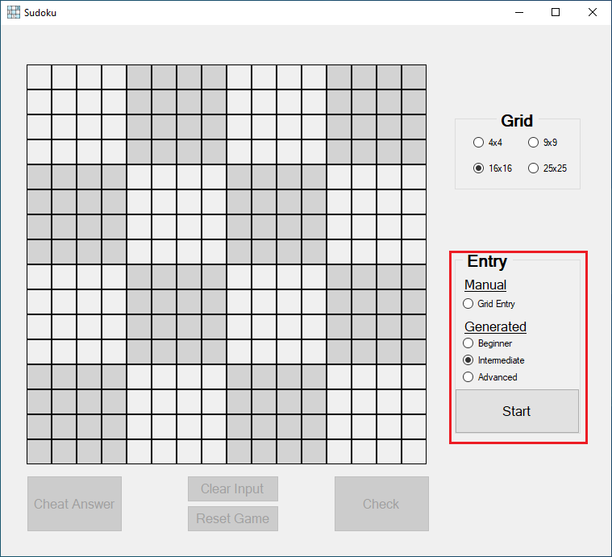

# Sudoku

**Sudoku Solver** is an application and website that allows users to play and solve Sudoku puzzles. It provides a user-friendly interface for interacting with the puzzle board and offers different game modes and grid sizes.

## Features
Rather than it allowing different grid sizes than the typical 9x9 grid, **Sukudo Solver** has the following features:

- Ability to choose the grid size (4x4, 9x9, 16x16, or 25x25) using the radio buttons.
- Two game modes: manual and generated.
- Manual Game Mode: Allows users to manually fill in the puzzle board and solve the Sudoku puzzle on their own.
- In level game mode, the application generates a random Sudoku puzzle with a specified number of hints based on the difficulty level chosen (beginner, intermediate, or advanced).
- Validates user input and provides feedback on incorrect entries.
- Provides hints by showing a random set of correct values on the board.
- Ability to clear the input cells and start a new game.
- Option to reveal the correct answer for a cell (cheat mode).
- Applies different styles and colors to the Sudoku grid cells.
- Provides a user-friendly graphical interface.
- Future-proof and highly scalable code

## System Architecture

The system consists of a website and an application client, both connected to a server supporting a RESTful API. The website and application client individually communicate with the server-side components through HTTP requests, enabling seamless data exchange and interaction between each client and the server.

>
>Figure 1.0

>**Warning:**
>Currently **SudokuWebsiteClient** and **SudokuServer** are still in development

## Architucture

.NET Core 7.0 for website and API

.NET Framework 4.8 for application

## Getting Started
For release access, you could simply access the folder "release" in the root directory of this repository; otherwise, you could anytime debug the program as follows:

1. Clone the repository: `git clone https://github.com/joYousefShaban/sudoku-solver/`
2. Navigate to the solution file `SudokuDesktopClient.sln` in Visual Studio.
3. Build the solution to restore the NuGet packages and compile the project.
4. Run the application by clicking the "Start" button in Visual Studio or pressing `F5`.
>
>Figure 1.1

>**Warning:**
>Currently **SudokuWebsiteClient** and **SudokuServer** are still in development

    Tip: You can run multiple projects (two or more) at the same time by doing the following:

    Right clicking on the sudoko-solver solution in the solution explorer => properties => common properties tab => startup project tab => then choose the radio button "Multiple Startup Projects".


## Calculation of Sudoku Combinations
* 4x4 Sudoku Grid

    >A 4x4 Sudoku grid consists of 4 rows and 4 columns, resulting in a total of 16 cells. Each cell can be filled with a number from 1 to 4. To calculate the number of possible combinations (Please check the validations section for more information)
    4 * 4 * 4 * ... (16 times) = `4^16` = 1,440

Hence, there are 1,440 possible Sudoku combinations for a 4x4 grid.

* 9x9 Sudoku Grid

    >A 4x4 Sudoku grid consists of 9 rows and 9 columns, resulting in a total of 81 cells. Each cell can be filled with a number from 1 to 9. To calculate the number of possible combinations (Please check the validations section for more information)
    9 * 9 * 9 * ... (81 times) = `9^81` = 6,670,903,752,021,072,936,960

* 16x16 Sudoku Grid

    >A 16x16 Sudoku grid consists of 16 rows and 16 columns, resulting in a total of 256 cells. Each cell can be filled with a number from 1 to F. To calculate the number of possible combinations (Please check the validations section for more information)
    16 * 16 * 16 * ... (256 times) = `16^256` = 6.67 x 10^109

* 25x25 Sudoku Grid

    >A 4x4 Sudoku grid consists of 25 rows and 25 columns, resulting in a total of 625 cells. Each cell can be filled with a number from 1 to P. To calculate the number of possible combinations (Please check the validations section for more information)
    25 * 25 * 25 * ... (625 times) = `25^625` = 3.96 x 10^2086 

>**note:** Please note that these numbers represent the theoretical number of possible combinations, not all combinations are valid Sudoku solutions. The actual number of valid Sudoku solutions for a given grid can be significantly smaller.


## Usage
1. Decide the launch behaviour for the program, in this case, it will be SudokuDesktopClient:
2. Launch the Sudoku Desktop Client application.
    
    Figure 1.2
3. Select the desired grid size (4x4, 9x9, 16x16, 25x25).
    
    Figure 1.3
4. Choose the game mode (Manual, Beginner, or Intermediate).
    
    Figure 1.4
5. Start playing the Sudoku puzzle using the provided interface:
   - For Manual Game Mode, click on the cells to enter your own values.
    
    Figure 1.5
   - For Beginner and Intermediate Game Modes, the puzzle board will be partially filled with random hints.
    
    Figure 1.6
6. Use the provided buttons to check your entries, clear the input cells, or reveal the correct answer for a cell (cheat mode).
    
    Figure 1.7
7. Once you have filled in all the cells, click the "Check" button to validate your solution.
    
    Figure 1.8
8. A message will be displayed indicating whether the puzzle has been solved successfully.
    
    
    Figures 1.9 and 1.10

> **Note**
> The grid of 25x25 is already developed, although due to the large grid size of the puzzle, the computational power will be high; hence, this size option is turned off


## Validation
**Sudoku Solver** expects the following criterias to be met:
* Input criteria:

    For 4x4 grid: { '1', '2', '3', '4' };

    For 9x9 grid: { '1', '2', '3', '4', '5', '6', '7', '8', '9' };

    For 16x16 grid: { '1', '2', '3', '4', '5', '6', '7', '8', '9', 'A', 'B', 'C', 'D', 'E', 'F', 'G' }

    for 25x25 grid: { '1', '2', '3', '4', '5', '6', '7', '8', '9', 'A', 'B', 'C', 'D', 'E', 'F', 'G', 'H', 'I', 'J', 'K', 'L', 'M', 'N', 'O', 'P' };

* Sudoku Rules assure criteria for each cell the following: (Code Snippet provided.)
    * Uniqueness in column
    * Uniqueness in row
    * Uniqueness in block
    ``` c#
    private bool IsCellValid(char value, int x, int y)
    {
        for (int i = 0; i < gridSize; i++)
        {
            // Check all the cells in vertical direction
            if (i != y && gridCells[x, i].CorrectAnswer == value)
                return false;

            // Check all the cells in horizontal direction
            if (i != x && gridCells[i, y].CorrectAnswer == value)
                return false;
        }

        // Check all the cells in the specific block
        int sqrtGridSize = (int)Math.Sqrt(gridSize);
        for (int i = (x - (x % sqrtGridSize)); i < x - (x % sqrtGridSize) + sqrtGridSize; i++)
        {
            for (int j = (y - (y % sqrtGridSize)); j < y - (y % sqrtGridSize) + sqrtGridSize; j++)
            {
                if (i != x && j != y && gridCells[i, j].CorrectAnswer == (char)value)
                    return false;
            }
        }
        return true;
    }
    ```


## Troubleshooting

- If you encounter any issues while running the application, ensure that you have the required .NET Framework version installed.
- If you apply the grid of 25x25, please use a powerful device that could handle this large amount of possibilities.
- Make sure to build the solution before running the application to ensure that all dependencies are correctly resolved.

## Contributing

Contributions are welcome! If you find any issues or have suggestions for improvements, please open an issue or submit a pull request, or even get in contact with me.


## Acknowledgments

The Sudoku solving algorithm used in this application is based on the backtracking algorithm commonly used for solving Sudoku puzzles.

## Contact

For any inquiries or feedback, please contact [jo.yousefshaban@gmail.com](mailto:jo.yousefshaban@gmail.com)

Enjoy playing Sudoku with the Sudoku Solver!

------------
